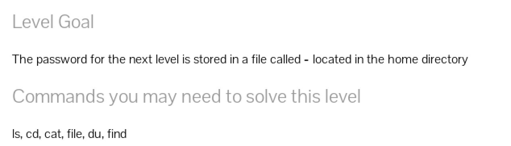
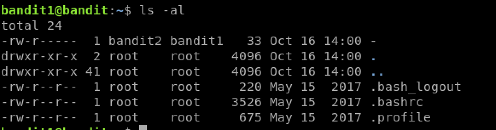

# Bandit Level 1 to 2

Connect to this level using the following SSH command
`ssh bandit.labs.overthewire.org -p 2220 -l bandit 1`

Enter the password you got from the readme file in the last level.

Once connected, we have our shell in the Home directory.
`ls -al`

We see we got a file named - in the home directory.

Now if you enter `cat -` that won't siplay the file contents, rather put in
the entire path to the file `cat /home/bandit1/-`

There we get the password for the next level.
