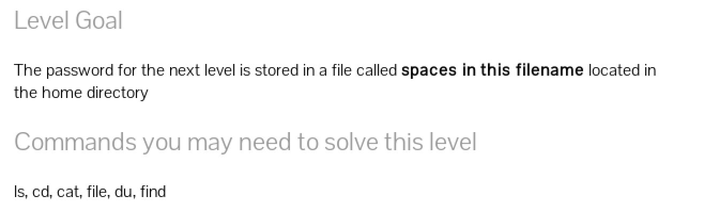
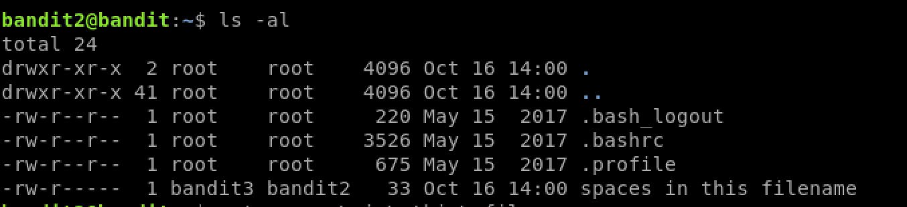

# Bandit Level 2 to 3

Connect to this level via SSH using the following command and password from the last level
`ssh bandit.labs.overthwire.org -p 2220 -l bandit2`

On logging in we are in the home directory, running `ls -al` shows we have a
file here with spaces. `spaces in this filename`

Now to see the contents of this file, run `cat spaces\ in\ this\ filename`

There we get the password for the next level. 
