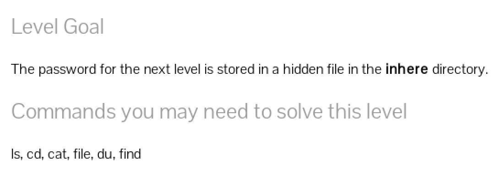
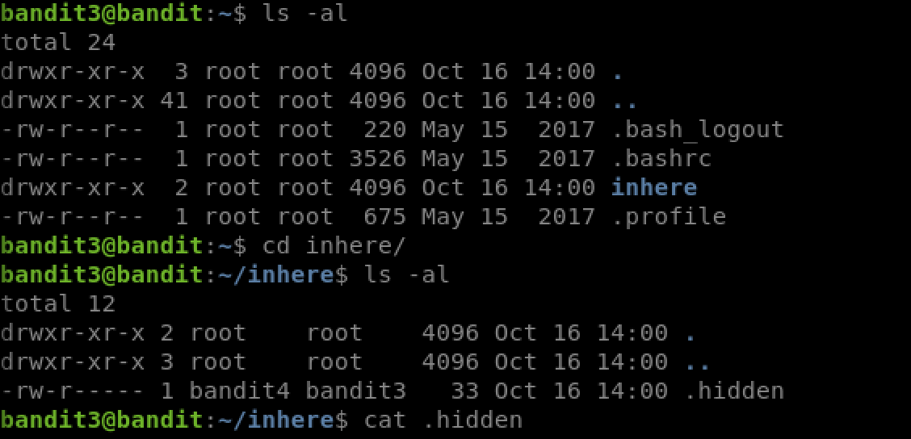

# Bandit Level 3 to 4

Connect to this level via SSH using the command
`ssh bandit.labs.overthewire.org -p 2220 -l bandit3`
Use the password string we got from the last level.

`ls -al` shows the that there is a directory named `inhere` in the home directory

`cd inhere` to goto that directory, now `ls -al` shows a hidden file `.hidden`

`cat .hidden` and there we get the passwrd for the next level!

